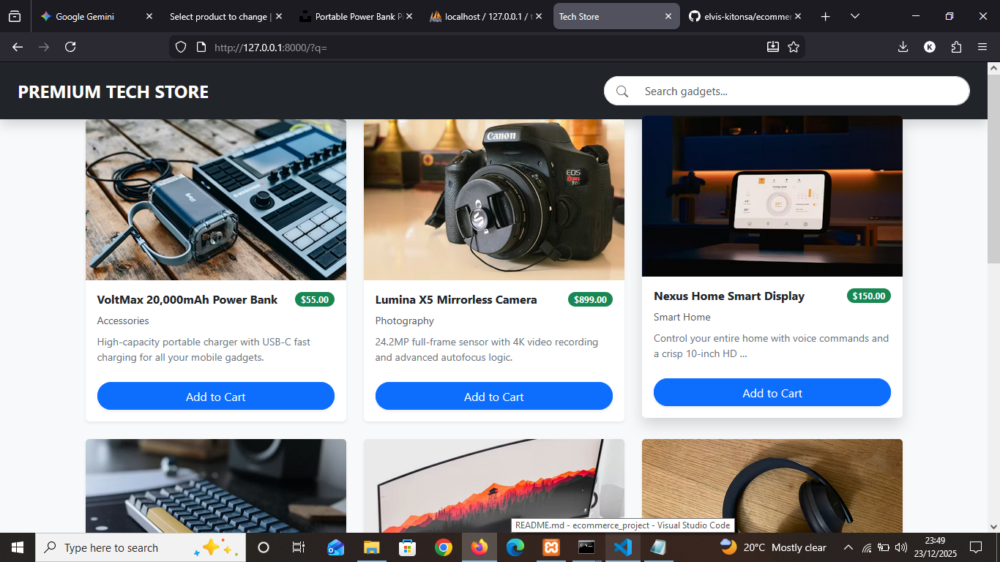

# 💡 Project Concept
**Premium Tech Store**

# 📝 Project Description
A sleek, responsive e-commerce storefront specializing in high-end gadgets. Built with Django and powered by MariaDB, this project demonstrates a full-stack integration from a custom database to a Bootstrap-themed frontend.

## 🤖 Development Process
This project was built using an **AI-augmented workflow**. 
I utilized **Google Gemini** as a thought partner to:
* Architect the Django static file routing.
* Refactor inline scripts into modular JavaScript.
* Debug real-time search logic and MariaDB integration.

## ✨ Features
* **Dynamic Product Grid:** Automatically renders tech items from the MariaDB database.
* **Polished UI:** Custom Bootstrap cards with hover effects and uniform image scaling.
* **Smart Truncation:** Product descriptions are automatically summarized to keep the layout consistent.
* **Live Pricing:** Items feature distinct price badges and "Add to Cart" functionality.
* **Search Engine:** (In Progress) Fast filtering to find specific gadgets instantly.

## 🛠️ Tech Stack
* **Backend:** Python / Django 4.2
* **Database:** MariaDB (via XAMPP)
* **Frontend:** Bootstrap 5, HTML5, CSS3
* **Database Connector:** PyMySQL

## ⚙️ Installation & Setup
1.  **Clone the Repository:**
    ```bash
    git clone [https://github.com/elvis-kitonsa/ecommerce_project.git](https://github.com/elvis-kitonsa/ecommerce_project.git)
    cd ecommerce_project
    ```
2.  **Environment Setup:**
    - Install dependencies: `pip install -r requirements.txt`
3.  **Database Configuration:**
    - Ensure XAMPP (MySQL/MariaDB) is running.
    - Create a database named `tech_store_db` via phpMyAdmin.
    - (Optional) Update `core/settings.py` with your local database credentials.
4.  **Initialize the Store:**
    - Build tables: `python manage.py migrate`
    - Start the server: `python manage.py runserver`

## 📂 Project Structure

Here is the project outline of the entire system:

```text
ecommerce_project/
├── core/                  # Project-wide settings and routing
│   ├── settings.py        # Database (MariaDB) & app configurations
│   └── urls.py            # Main URL dispatcher
├── shop/                  # Main store application logic
│   ├── migrations/        # Database schema history
│   ├── static/shop/       # Frontend assets
│   │   ├── css/           # Custom styling (style.css)
│   │   └── js/            # Interactivity (search.js)
│   ├── templates/shop/    # HTML pages (product_list.html)
│   ├── models.py          # Database structure for Products
│   ├── views.py           # Logic for displaying products
│   └── urls.py            # App-specific URL routes
├── media/                 # Uploaded product images
├── manage.py              # Django command-line utility
└── db.sqlite3 / MariaDB   # Project database
```

## 📸 Preview


