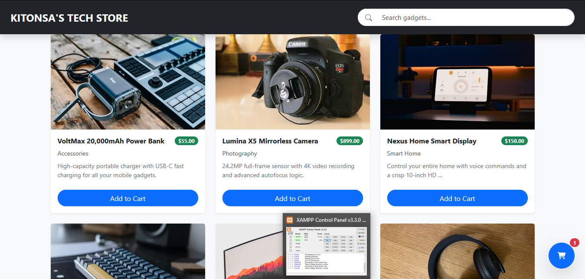

# 💡 Project Concept

**KITONSA'S TECH STORE**

# 📝 Project Description

A sleek, responsive e-commerce storefront specializing in high-end gadgets. Built with **Django** and **powered by MariaDB**, this project demonstrates a **full-stack integration** from a custom database to a highly interactive, "app-like" frontend experience.

# 🤖 Development Process

This project was built using an AI-augmented workflow. I **utilized Google Gemini** as a **technical thought partner** to:

    1. Architect the Django static file routing and MariaDB integration.

    2. Refactor procedural scripts into modular, Vanilla JavaScript.

    3. Implement LocalStorage state management for the shopping cart.

# ✨ Features

    1. Dynamic Product Grid: Automatically renders tech items from the MariaDB database.

    2. Smart Live Search: Instant, client-side filtering that searches titles and descriptions as you type.

    3. Persistent Shopping Cart: Items stay in your cart even if you refresh or close the browser, thanks to the LocalStorage API.

    4. Advanced Cart Management: Includes quantity toggles, "Clear Cart" functionality, and automated total price calculation.

    5. Order Success Workflow: A professional checkout simulation using a Bootstrap 5 Modal for order confirmation.

    6. Polished UI: Custom hover effects, uniform image scaling, and a floating cart indicator with real-time badges.

    7. Dual Payment Gateway: Integrated PayPal SDK for international credit card payments and a manual Mobile Money flow for local (Uganda) transactions.

    8. Dynamic Cart Management: Vanilla JavaScript implementation for adding/removing items using localStorage.

    9. Order Confirmation: Dedicated success page to improve User Experience (UX) and provide transaction verification timelines.

# 🛠️ Tech Stack

    1. Backend: Python / Django 4.2

    2. Database: MariaDB (via XAMPP)

    3. Frontend: JavaScript (ES6+), Bootstrap 5, FontAwesome, HTML5/CSS3

    4. Database Connector: PyMySQL

# 📂 Project Structure

Here is the updated project structure

```
ecommerce_project/
├── core/                       # Project configuration
│   ├── settings.py
│   ├── urls.py                 # Main URL routing (includes shop.urls)
│   └── wsgi.py
├── shop/                       # Main application logic
│   ├── migrations/             # Database migration history
│   ├── static/
│   │   └── shop/
│   │       ├── css/            # Custom styles
│   │       └── js/             # External scripts (if any)
│   ├── templates/
│   │   └── shop/
│   │       ├── product_list.html  # Homepage / Catalog
│   │       ├── cart.html          # Shopping cart & Payment Logic (PayPal/Momo)
│   │       └── success.html       # Thank You / Order Confirmation page
│   ├── admin.py                # Admin panel configuration
│   ├── models.py               # Product & Order database models
│   ├── urls.py                 # App-specific routing
│   └── views.py                # Logic for cart, products, and success page
├── manage.py
└── db.sqlite3                  # Local development database
```

# ⚙️ Installation & Setup

Clone the Repository:

```
git clone https://github.com/elvis-kitonsa/ecommerce_project.git
cd ecommerce_project
```

Environment Setup:

```
pip install -r requirements.txt
```

Database Configuration:

    Ensure XAMPP (MySQL/MariaDB) is running and create a database named tech_store_db.
    Update core/settings.py with your credentials.

Initialize & Run:

    python manage.py migrate
    python manage.py runserver

# 📸 Preview

This is how the Tech shop's dashboard looks like:


